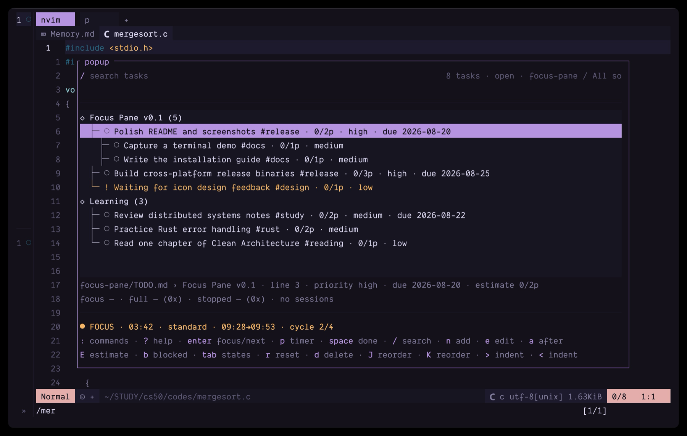

# Focus Pane

[](https://github.com/peterwyr-dev/focus-pane/actions/workflows/ci.yml)
[](LICENSE)

A standalone Markdown task manager and Pomodoro timer for the terminal, built with Rust and
[Ratatui](https://ratatui.rs/). Herdr integration is optional.



## Features

- Reads and updates `- [ ]` / `- [x]` tasks from one file or named multi-file workspaces
- One global default `TODO.md`, plus explicit files and named workspace globs
- Stable hidden task IDs preserve timing history when Markdown lines move
- Task-independent Focus → Coffee Break → Focus cycles with explicit waiting/paused states
- Named focus presets persisted with active timer durations for detached workers
- Separate active and next-task contexts keep session attribution correct when the queue changes
- Pomodoro estimates with actual/estimate progress and completed-task variance
- Blocked tasks with searchable metadata and a distinct list marker/style
- SQLite session history with completed/stopped outcome breakdowns
- Timer state that survives closing the TUI
- Searchable tree UI, command palette, contextual help, and full-row selection
- Compact, normal, and wide layouts down to a tested 32×10 minimum
- Automatically reloads external Markdown edits without discarding an open dialog
- Serializes concurrent writes and rejects conflicting task changes
- Optional Herdr notifications and `$focus` sidebar countdown

## Supported platforms

Prebuilt releases target:

- macOS on Apple Silicon (`aarch64`)
- macOS on Intel (`x86_64`)
- Linux on `x86_64` with glibc

Windows is not currently supported.

## Installation

### Prebuilt binary

Download the archive for your platform from
[GitHub Releases](https://github.com/peterwyr-dev/focus-pane/releases), then install the binary:

```bash
VERSION=v0.1.0
TARGET=aarch64-apple-darwin # or x86_64-apple-darwin / x86_64-unknown-linux-gnu
archive="focus-pane-$VERSION-$TARGET"
tar -xzf "$archive.tar.gz"
mkdir -p ~/.local/bin
install -m 755 "$archive/focus-pane" ~/.local/bin/focus-pane
```

Ensure `~/.local/bin` is on your `PATH`. On macOS, a browser-downloaded unsigned binary may be
quarantined; after verifying the checksum and source, remove the quarantine attribute with:

```bash
xattr -d com.apple.quarantine ~/.local/bin/focus-pane
```

### Build from source

Focus Pane requires Rust 1.88 or newer:

```bash
cargo install --locked --git https://github.com/peterwyr-dev/focus-pane --tag v0.1.0
```

## Quick start

Open the default global task file:

```bash
focus-pane
```

Or use a specific Markdown file:

```bash
focus-pane --file ~/notes/TODO.md
```

Press `n` to add the first task. `focus-pane setup` optionally creates the default configuration.
The example files in [`examples/`](examples/) demonstrate task metadata and timer presets.

Runtime configuration and data are stored at:

```text
~/.config/focus-pane/config.toml
~/.local/share/focus-pane/TODO.md
~/.local/share/focus-pane/focus.db
```

Relative `tasks.file` values are resolved inside the data directory, not from the shell's current
working directory.

## Optional Herdr integration

Run `focus-pane setup` to print a popup configuration snippet, or configure Herdr directly:

```toml
[[keys.command]]
key = "prefix+t"
type = "popup"
command = 'exec "$HOME/.local/bin/focus-pane" --cwd "$HERDR_ACTIVE_PANE_CWD" --pane "$HERDR_ACTIVE_PANE_ID"'
description = "Focus Pane"
width = "88%"
height = "84%"
```

## Keys

| Key | Action |
| --- | --- |
| `↑` / `↓`, `j` / `k` | Select task |
| `/` | Search tasks |
| `:` | Open the searchable command palette |
| `?` | Open contextual help; unavailable commands are dimmed |
| `Enter` | Start a focus cycle from the selected task; while it runs, set the next task context |
| `t` | Start a task-independent focus cycle |
| `Space` | Toggle the Markdown checkbox; completing one queues the next open task |
| `u` | Undo the most recent completion from the current Focus Pane window |
| `n` | Append a task to the file |
| `a` | Add a sibling after the selected task and its subtree |
| `e` | Edit task text while preserving Focus metadata |
| `E` | Set a Pomodoro estimate; submit empty or `0` to clear it |
| `b` | Toggle blocked status without completing the task |
| `J` / `K` | Move the selected task subtree down/up within its heading |
| `>` / `<` | Indent/outdent the selected task subtree |
| `d` | Open delete confirmation |
| `p` | Start a ready phase, or pause/resume a running countdown |
| `r` | Reset the current focus or break countdown |
| `s` | Stop timer and save partial focus time |
| `P` | Cycle the configured focus preset while idle |
| `W` | Switch to the next configured workspace |
| `F` | Cycle the aggregate and individual Markdown source views |
| `Tab` | Cycle open, completed, and all tasks |
| `Esc` | Cancel a panel, or close Focus Pane |

Deleting removes only the Markdown task line. SQLite focus history remains; if the deleted task
was queued as next, the timer simply clears that context.

## Workspaces and Markdown sources

With no workspace configuration, Focus Pane opens `~/.local/share/focus-pane/TODO.md`. Relative
`tasks.file` values are resolved inside that data directory, so opening the app never creates a task
file in the current project. Absolute paths and `~/...` paths are used as written. `--file PATH`
always overrides workspace configuration and opens that source alone.

Named workspaces accept explicit files and glob patterns:

```toml
[[workspaces]]
name = "Study"
files = ["~/notes/TODO.md", "../coursework/DISTRIBUTED.md"]

[[workspaces]]
name = "Projects"
files = ["~/code/*/TODO.md"]
```

Relative paths are resolved from `config.toml`; `~` is expanded and globs are evaluated at startup.
The workspace whose source is nearest to the originating directory is selected initially. Press `W`
to switch workspace and `F` to cycle `All sources` and each individual file. Aggregate headings are
qualified with their source, so duplicate Markdown headings stay distinct.

Mutations always use the selected task's source. In an empty aggregate view, `n` targets the first
explicit source; an explicit missing source is shown as `[missing]` and can be created by adding a
task. Unmatched globs and unreadable entries are shown as `[unavailable]`. Each source keeps its own
sidecar lock/revision checks, while SQLite history is qualified by both stable task ID and source path.

## Timer presets and transitions

Legacy flat `[timer]` durations remain supported. Named presets can be configured as:

```toml
[timer]
default_preset = "standard"
auto_start_break = true
auto_start_focus = false

[[timer.presets]]
name = "standard"
focus_minutes = 25
break_minutes = 5
long_break_minutes = 15
cycles_before_long_break = 4

[[timer.presets]]
name = "deep"
focus_minutes = 50
break_minutes = 10
long_break_minutes = 20
cycles_before_long_break = 3
```

Press `P` while idle to cycle presets. Starting a cycle stores the preset name and duration snapshot
in SQLite, so a detached worker keeps using those values even if configuration is reloaded.

`ReadyForBreak` and `ReadyForFocus` mean a countdown has not started; press `p` to start it.
`PausedFocus` and `PausedBreak` only mean a countdown was running and was explicitly paused.

## Command UI and responsive layout

Normal-mode key dispatch, command-palette entries, help rows, availability, and footer keys all come
from one command registry. The palette only lists commands available in the current task/timer
context; help keeps unavailable commands visible but dimmed.

The TUI selects compact mode below 72 columns or 18 rows, normal mode below 110 columns, and wide
mode otherwise. Compact mode hides secondary counts and collapses status/footer content while
keeping tasks, timer state, `:` commands, and `?` help accessible. The tested minimum is 32×10.

## Markdown task metadata

Focus Pane recognizes standard hashtags in task text and optional trailing hidden metadata:

```md
- [ ] Read chapter #study #course/distsys <!-- focus:estimate=3 status=blocked priority=high due=2026-04-01 --> <!-- focus:id=abc123 -->
```

Supported keys are `id`, `estimate`, `status=blocked`, `priority=high|medium|low`, and an ISO
`due=YYYY-MM-DD` date. Multiple trailing `<!-- focus:... -->` comments are accepted. Unknown keys
are preserved during edits so newer or external metadata is not destroyed. Estimates are measured
in the currently configured focus duration. Completed tasks show actual-versus-estimated variance;
blocked tasks remain open, searchable, focusable, and retain their existing session history.

Focus Pane uses a persistent hidden sidecar such as `.TODO.md.focus-pane.lock` beside each task
file. The advisory lock lets multiple Focus Pane processes serialize read-modify-write operations;
it contains no task data and can be added to global ignore rules as `.*.focus-pane.lock`.

## Development

```bash
cargo fmt --check
cargo clippy --locked --all-targets --all-features -- -D warnings
cargo test --locked --all-targets --all-features -- --test-threads=1
cargo run -- --file examples/TODO.md
cargo build --locked --release
cargo package --locked
```

## Compatibility contracts

Do not change these without an explicit migration:

- `TODO.md` checkbox syntax and `<!-- focus:id=... -->`
- `timer_state` and `focus_sessions` SQLite tables; legacy databases are migrated additively
- epoch-second timestamps stored as SQLite `REAL`
- Herdr environment variables and `focus` sidebar metadata token

## License

Focus Pane is available under the [MIT License](LICENSE).
